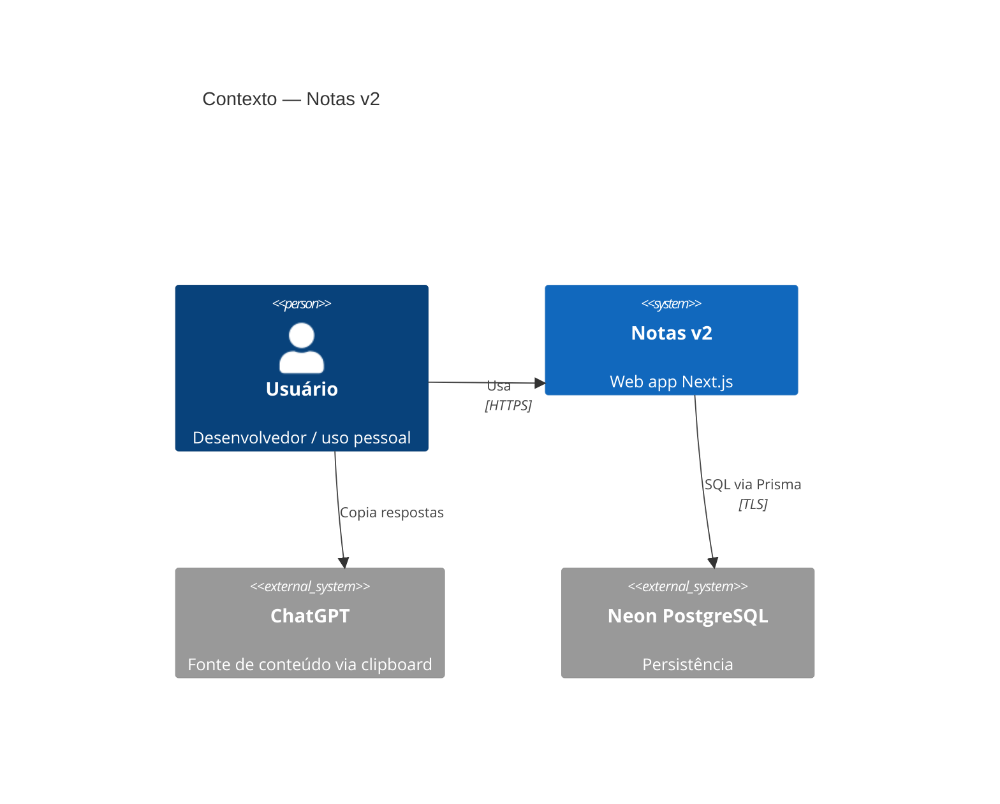
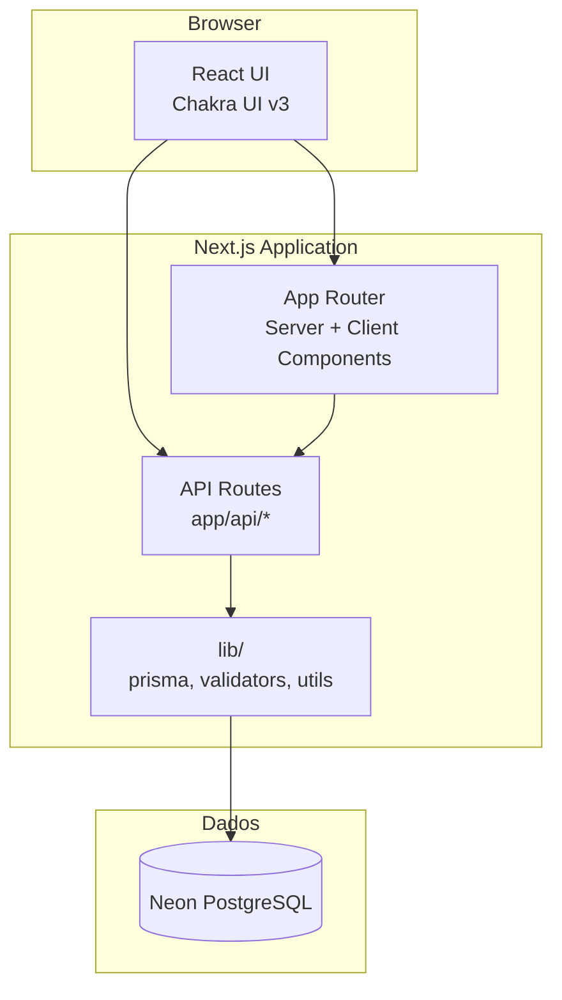
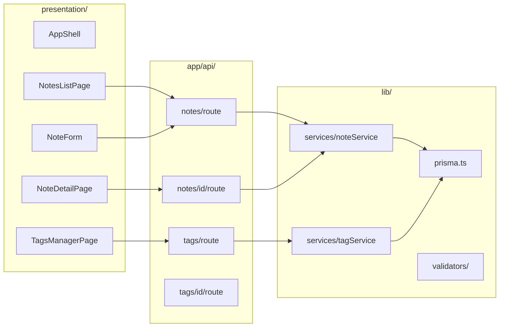
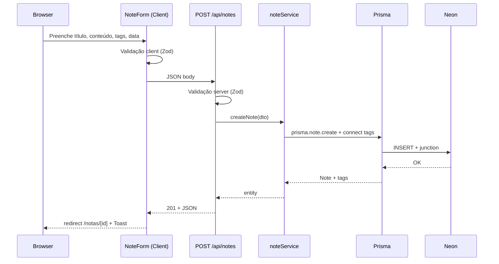
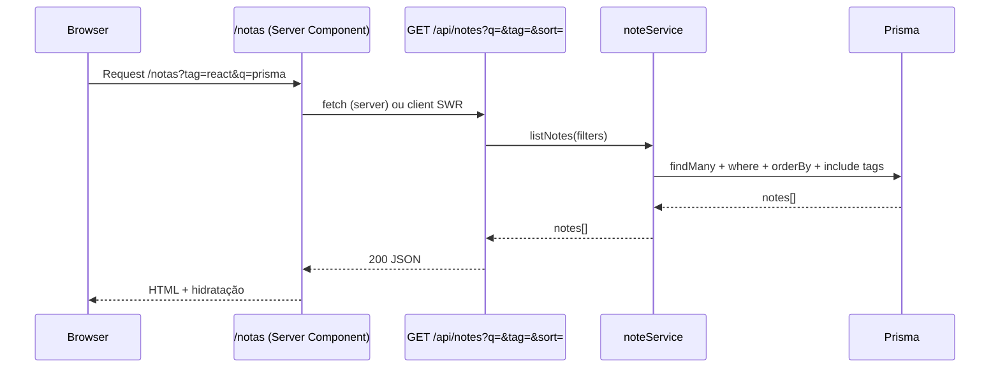
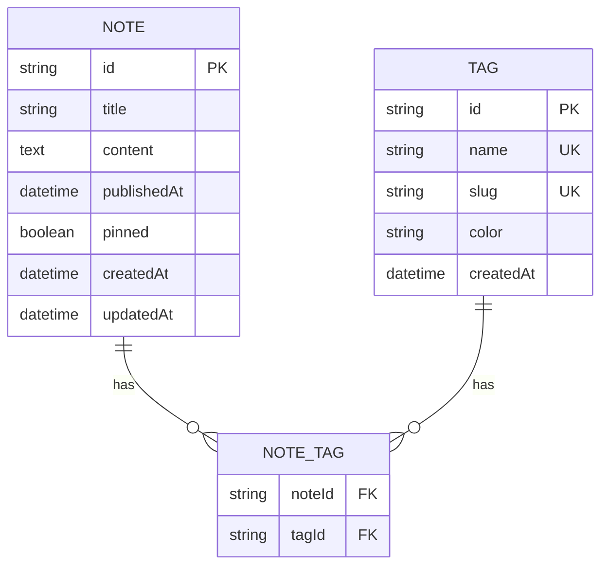
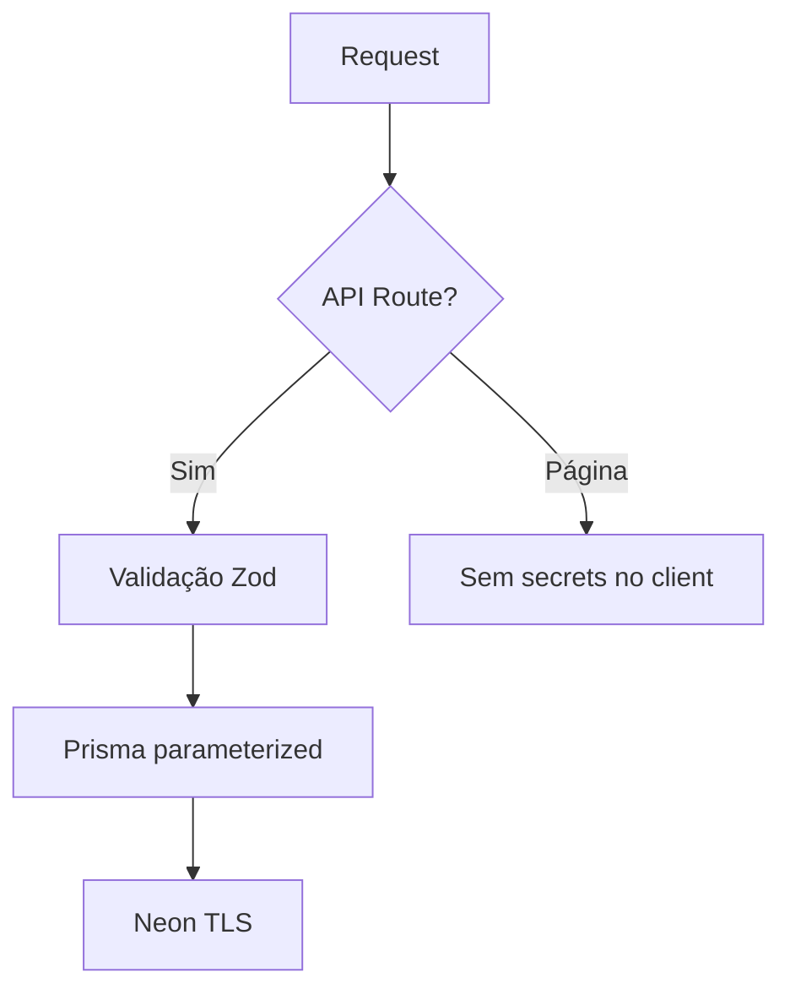
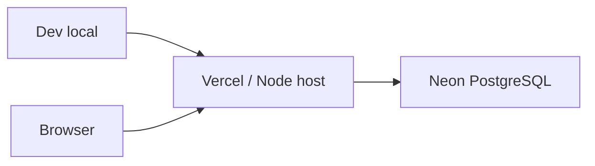

# Diagramas de Arquitetura — Notas v2

**Versão:** 1.0  
**Data:** 2026-05-20  
**Referências:** `outputs/product-owner/requirements.md`, `outputs/ux/wireframes/01-information-architecture.md`

---

## 1. Visão geral (C4 — Contexto)

Sistema web pessoal de notas. Um único usuário interage via browser; não há integrações externas obrigatórias no MVP.



---

## 2. Visão de containers (C4 — Nível 2)

Arquitetura **monolito modular** em um único deploy Next.js (sem microserviços no MVP).



| Container | Responsabilidade | Tecnologia |
|-----------|------------------|------------|
| **UI** | Renderização, interação, tema, Markdown client | React 19, Chakra UI v3 |
| **App Router** | Rotas, SSR/SSG seletivo, layouts | Next.js 15 App Router |
| **API Routes** | CRUD REST, validação, acesso DB | Route Handlers |
| **lib** | Prisma client, schemas Zod, helpers | TypeScript |
| **Neon** | Persistência relacional | PostgreSQL serverless |

---

## 3. Componentes internos (C4 — Nível 3)



### Responsabilidades por camada

| Camada | Faz | Não faz |
|--------|-----|---------|
| **Páginas (`app/`)** | Composição UI, fetch de dados (server ou client), estados de loading | SQL direto; regras de negócio complexas |
| **Componentes (`components/`)** | UI reutilizável, sem conhecimento de Prisma | Chamadas API acopladas (preferir props/callbacks) |
| **API Routes** | HTTP, status codes, validação entrada, orquestração | Lógica de apresentação |
| **Services (`lib/services/`)** | Regras de negócio, queries Prisma compostas | Retornar Response HTTP |
| **Prisma** | Acesso a dados, migrations | Validação de domínio rica |

---

## 4. Fluxo de dados — Criar nota



---

## 5. Fluxo de dados — Listar com filtros



**Query params suportados (evolução):**

| Param | MVP | Fase 1+ |
|-------|-----|---------|
| `q` | título `contains` | título OR conteúdo `contains` |
| `tag` | slug ou id da tag | — |
| `sort` | `date-desc` (default) | `date-asc`, `title-asc` |
| `from`, `to` | — | filtro `publishedAt` |

---

## 6. Modelo de dados (ER)



### Índices recomendados

| Tabela | Índice | Motivo |
|--------|--------|--------|
| `Note` | `publishedAt DESC` | Ordenação padrão |
| `Note` | GIN/trgm em `title` (Fase 1) | Busca full-text |
| `Note` | GIN/trgm em `content` (Fase 1) | Busca no corpo |
| `Tag` | `slug` unique | Filtro URL |
| `NoteTag` | `(tagId, noteId)` | Filtro por tag |

*Extensão `pg_trgm` no Neon para busca ILIKE performática em Fase 1.*

---

## 7. Mapa de rotas (App Router)

```
app/
├── layout.tsx                 # Providers: Chakra, color mode
├── page.tsx                   # redirect → /notas
├── notas/
│   ├── page.tsx               # Lista (US-002)
│   ├── nova/
│   │   └── page.tsx           # Criar (US-001)
│   └── [id]/
│       ├── page.tsx           # Visualizar (US-005)
│       └── editar/
│           └── page.tsx       # Editar (US-003)
├── tags/
│   └── page.tsx               # CRUD tags (US-007)
└── api/
    ├── notes/
    │   ├── route.ts           # GET list, POST create
    │   └── [id]/
    │       └── route.ts       # GET, PUT, DELETE
    └── tags/
        ├── route.ts           # GET list, POST create
        └── [id]/
            └── route.ts       # GET, PUT, DELETE
```

---

## 8. Mapa de API REST

| Método | Endpoint | Descrição | Status |
|--------|----------|-----------|--------|
| `GET` | `/api/notes` | Lista com `?q`, `?tag`, `?sort` | 200 |
| `POST` | `/api/notes` | Cria nota + tags | 201 |
| `GET` | `/api/notes/:id` | Detalhe | 200 / 404 |
| `PUT` | `/api/notes/:id` | Atualiza | 200 / 404 |
| `DELETE` | `/api/notes/:id` | Remove + desvincula tags | 204 / 404 |
| `GET` | `/api/tags` | Lista com `_count.notes` | 200 |
| `POST` | `/api/tags` | Cria tag | 201 |
| `GET` | `/api/tags/:id` | Detalhe | 200 / 404 |
| `PUT` | `/api/tags/:id` | Atualiza nome/cor | 200 / 404 |
| `DELETE` | `/api/tags/:id` | Remove; cascade junction | 204 / 404 |

---

## 9. Estratégia de renderização (Next.js)

| Rota | Estratégia | Justificativa |
|------|------------|---------------|
| `/notas` | Server Component + revalidate on demand | SEO irrelevante; dados frescos; menos JS |
| `/notas/[id]` | Server Component | Conteúdo grande; MD pode ser server-rendered |
| `/notas/nova`, `editar` | Client Component | Form interativo |
| `/tags` | Client ou Server | CRUD com modais — Client preferível |
| API | Dynamic | Sempre fresh |

**Revalidação:** `revalidatePath('/notas')` após mutations em API Routes.

---

## 10. Segurança (MVP)



| Controle | MVP | Futuro |
|----------|-----|--------|
| Autenticação | Nenhuma (uso pessoal, rede privada ou deploy protegido) | NextAuth / middleware |
| `DATABASE_URL` | Apenas server | — |
| Rate limit | Opcional Vercel | — |
| XSS Markdown | rehype-sanitize | — |
| CSRF | Same-origin fetch + cookies padrão Next | — |

---

## 11. Deploy (visão alvo)



- **App:** Vercel (recomendado para Next.js) ou Docker + Node
- **DB:** Neon (branch dev/prod separados)
- **Env:** `DATABASE_URL`, `NODE_ENV` — ver `tech-stack.md`

---

## 12. Evolução arquitetural (fases)

| Fase | Mudança arquitetural |
|------|----------------------|
| 0–1 | Monolito Next + Neon |
| 1 | `pg_trgm` + busca composta |
| 2 | Campo `pinned`, índices compostos |
| 3 | PWA (service worker, manifest) — mesmo backend |
| 4 | Busca semântica: worker ou API route + embeddings store |

---

## 13. Rastreabilidade

| Requisito PO | Componente |
|--------------|--------------|
| RF-N01–04 | `noteService` + `/api/notes` |
| RF-T01–03 | `tagService` + `/api/tags` |
| RF-U01 | AppShell responsivo |
| RNF-P01–03 | Índices + Server Components + paginação futura |
| RNF-S01–02 | API-only DB access + Zod |

---

*Diagramas de arquitetura — agente Architect, Notas v2.*
