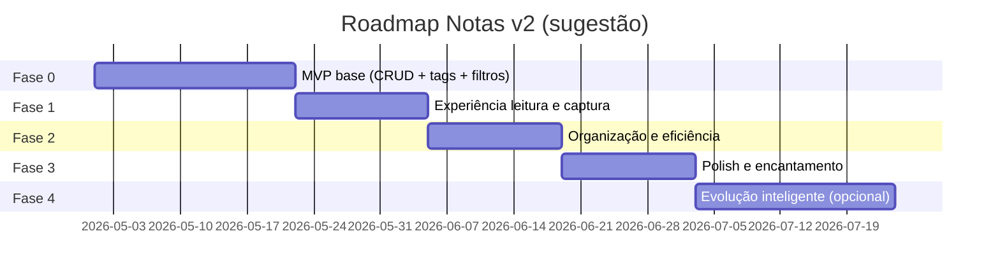

# Roadmap de Features — Notas v2

Roadmap sugerido em fases, alinhado ao MVP já planejado (CRUD notas/tags, visualização, filtros) e às sugestões priorizadas em `feature-suggestions.md`.

**Princípios:**
- Entregar valor no fluxo ChatGPT → salvar → ler → encontrar o mais cedo possível.
- Sem prazo/orçamento fixos — fases por **sequência lógica de dependências**.
- Cada fase tem critério de “pronto” mensurável para o usuário solo.

---

## Visão geral das fases



---

## Fase 0 — MVP base (já planejado)

**Objetivo:** Sistema funcional mínimo para criar, editar, listar e visualizar notas com tags.

| Entrega | Status |
|---------|--------|
| CRUD de notas (título, conteúdo, data publicação) | Planejado |
| CRUD de tags + vínculo nota–tag | Planejado |
| Listagem com filtro por título | Planejado |
| Busca/filtro por tag | Planejado |
| Página de visualização com boa formatação | Planejado |

**Critério de pronto:** Usuário consegue salvar uma nota do ChatGPT, taguear, filtrar por título/tag e ler na página de detalhe.

**Duração estimada:** 2–3 semanas (depende da stack e disponibilidade).

---

## Fase 1 — Experiência de leitura e captura (P1)

**Objetivo:** Tornar o fluxo principal rápido e agradável; fechar gaps de paridade competitiva.

| # | Feature | Prioridade |
|---|---------|------------|
| 1.1 | Renderização **Markdown** na visualização (e preview na edição) | P1 |
| 1.2 | **Paste-to-note** (colar com auto-título e data) | P1 |
| 1.3 | **Busca full-text** no conteúdo + destaque | P1 |
| 1.4 | **Tema claro/escuro** com persistência | P1 |
| 1.5 | **Syntax highlight** + botão copiar em blocos de código | P2 |

**Critério de pronto:** Colar resposta longa do ChatGPT → ver formatada → achar por palavra no corpo em &lt; 3s.

**Duração estimada:** 1–2 semanas.

**Dependências:** Fase 0 concluída.

---

## Fase 2 — Organização e eficiência (P2)

**Objetivo:** Escalar o uso com muitas notas sem fricção.

| # | Feature | Prioridade |
|---|---------|------------|
| 2.1 | Ordenação (data, título) + **filtros combinados** (tag + texto + data) | P1 |
| 2.2 | **Tags com cor** e contagem na sidebar | P1 |
| 2.3 | **Vista cards / lista** alternável | P2 |
| 2.4 | **Notas fixadas** no topo | P2 |
| 2.5 | **Filtro por intervalo de datas** | P2 |
| 2.6 | **Atalhos de teclado** essenciais | P2 |
| 2.7 | **Export/import** JSON e Markdown | P2 |

**Critério de pronto:** Com 100+ notas, usuário localiza qualquer nota em menos de 30 segundos.

**Duração estimada:** 1–2 semanas.

---

## Fase 3 — Polish e encantamento (P2–P3)

**Objetivo:** Atender métrica de sucesso: “visual moderno, bonito e intuitivo”.

| # | Feature | Prioridade |
|---|---------|------------|
| 3.1 | **Modo leitura zen** (tipografia, largura, sem distrações) | P2 |
| 3.2 | **Templates de prompt** (biblioteca + copiar) | P2 |
| 3.3 | **Tags sugeridas** ao salvar | P2 |
| 3.4 | **Dashboard** “Minha semana em notas” | P3 |
| 3.5 | **Estatísticas** leves (notas/mês, tags top) | P3 |
| 3.6 | **Histórico de versões** leve (últimas N edições) | P3 |

**Critério de pronto:** Usuário prefere abrir Notas v2 em vez de arquivo `.md` solto no disco.

**Duração estimada:** 1–2 semanas.

---

## Fase 4 — Evolução inteligente e extensão (P3 — opcional)

**Objetivo:** Recursos avançados quando o volume de notas justificar investimento.

| # | Feature | Prioridade |
|---|---------|------------|
| 4.1 | Links **[[wiki-style]]** + backlinks | P3 |
| 4.2 | **Resumo automático** no card (API configurável) | P3 |
| 4.3 | **Busca semântica** (embeddings) | P3 |
| 4.4 | **PWA** instalável | P3 |
| 4.5 | **Extensão browser** “Salvar no Notas” | P3 |
| 4.6 | Integração **API OpenAI** (re-prompt na nota) | P3 |

**Critério de pronto:** Recuperação por conceito, não só palavra-chave; captura sem copiar/colar manual.

**Duração estimada:** 2–4 semanas (incremental).

---

## MVP recomendado para “lançamento pessoal”

Conjunto mínimo além do Fase 0:

```
Fase 0 + Fase 1 (itens 1.1–1.4) + ordenação básica da Fase 2
```

Isso equivale a:
- CRUD completo
- Markdown + paste rápido + busca no conteúdo
- Tags + filtros + tema escuro
- Visualização de nota excelente

---

## Cronograma sugerido (sequencial)

| Fase | Semanas acum. (estimativa) | Marco |
|------|----------------------------|-------|
| 0 | 0–3 | MVP usável |
| 1 | 3–5 | Fluxo ChatGPT otimizado |
| 2 | 5–7 | Escala 100+ notas |
| 3 | 7–9 | UX premium |
| 4 | 9+ | AI e extensões |

*Estimativas para 1 desenvolvedor em tempo parcial; ajustar conforme ritmo real.*

---

## Riscos por fase e mitigação

| Fase | Risco | Mitigação |
|------|-------|-----------|
| 1 | Parser Markdown inconsistente | Biblioteca madura (marked, markdown-it, MDX remoto) |
| 2 | Busca lenta em muitas notas | Índice client-side ou full-text no backend |
| 3 | Scope creep de dashboard | Widgets mínimos, iterar depois |
| 4 | Custo/complexidade AI | Feature flags; começar com regras, depois API |

---

## Handoff para outros agentes

| Agente | Entrada desta fase |
|--------|-------------------|
| **Product Owner** | Priorizar backlog P1/P2/P3 por fase |
| **UX** | Fluxos paste-to-note, modo zen, empty states |
| **UI Designer** | Design system claro/escuro, cards, tags coloridas |
| **Architect** | Modelo de dados para versões, busca, export |
| **Frontend/Backend Dev** | Implementação por sprint alinhada às fases |

---

*Roadmap vivo — revisar após validação do MVP (Fase 0) em uso real.*
