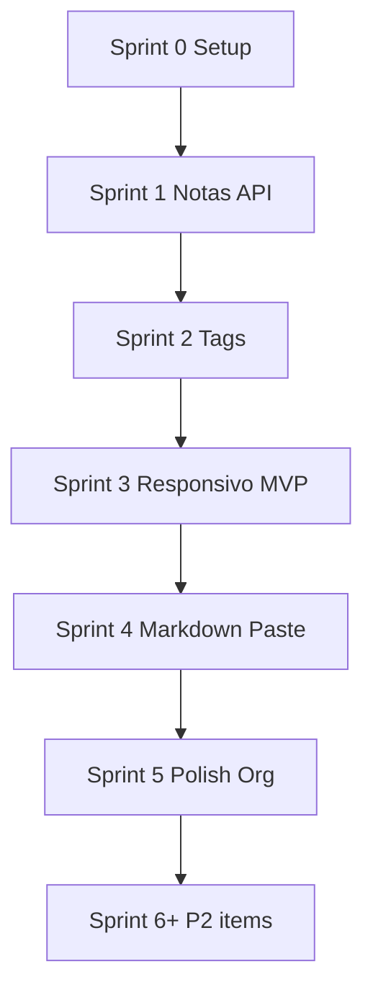

# Backlog Priorizado — Notas v2

**Última atualização:** 2026-05-20  
**Método de priorização:** Valor de negócio × esforço × dependências técnicas  
**Stack:** Next.js · API Routes · Prisma · Neon · Chakra UI v3

---

## Resumo executivo

| Sprint | Foco | Stories | Marco |
|--------|------|---------|-------|
| **Sprint 0** | Infra + schema + layout base | Setup | App sobe, DB conectado |
| **Sprint 1** | CRUD Notas + API | US-001–005 | Criar e ler notas |
| **Sprint 2** | Tags + filtros | US-006–009 | Organizar e filtrar |
| **Sprint 3** | Responsivo + polish MVP | US-010 | MVP Fase 0 completo |
| **Sprint 4** | Markdown + paste + tema | US-011–014 | Fluxo ChatGPT |
| **Sprint 5** | Código + ordenação + tags UI | US-015–017 | Escala e leitura técnica |
| **Sprint 6+** | Nice-to-have | US-018–021 | Eficiência avançada |

---

## Sprint 0 — Setup técnico (pré-requisito)

| # | Item | Tipo | Prioridade | Depende de |
|---|------|------|------------|------------|
| 0.1 | Inicializar projeto Next.js (App Router) | Tech | P0 | — |
| 0.2 | Configurar Chakra UI v3 + provider de tema | Tech | P0 | 0.1 |
| 0.3 | Configurar Prisma + schema Note/Tag + migrate Neon | Tech | P0 | Conta Neon |
| 0.4 | Estrutura `app/api/notes`, `app/api/tags` | Tech | P0 | 0.3 |
| 0.5 | Layout shell: header, nav, container responsivo | Tech | P0 | 0.2 |
| 0.6 | Variáveis `.env` documentadas (`DATABASE_URL`) | Tech | P0 | 0.3 |

**DoD Sprint 0:** `npm run dev` funciona; Prisma migrate aplicado no Neon; página placeholder responsiva.

---

## Sprint 1 — CRUD de notas (backend + UI)

| Ordem | ID | Story / Task | Valor | Esforço | Risco |
|-------|-----|--------------|-------|---------|-------|
| 1 | US-001 | POST `/api/notes` — criar nota | Alto | M | Baixo |
| 2 | US-001 | Formulário criar nota (Chakra Form) | Alto | M | Baixo |
| 3 | US-002 | GET `/api/notes` — listar | Alto | S | Baixo |
| 4 | US-002 | Página lista de notas (estado vazio) | Alto | M | Baixo |
| 5 | US-003 | PUT `/api/notes/[id]` — editar | Alto | M | Baixo |
| 6 | US-004 | DELETE `/api/notes/[id]` — excluir + modal confirmação | Médio | S | Baixo |
| 7 | US-005 | GET `/api/notes/[id]` + página `/notas/[id]` leitura básica | Alto | M | Baixo |

**DoD Sprint 1:** CRUD notas completo via API; fluxo criar → listar → ver → editar → excluir.

---

## Sprint 2 — Tags e filtros

| Ordem | ID | Story / Task | Valor | Esforço | Risco |
|-------|-----|--------------|-------|---------|-------|
| 1 | US-007 | CRUD `/api/tags` | Alto | M | Baixo |
| 2 | US-008 | Associar tags na nota (multi-select / chips) | Alto | M | Médio |
| 3 | US-009 | Filtro por tag na listagem (query `?tag=`) | Alto | S | Baixo |
| 4 | US-006 | Busca por título na listagem | Alto | S | Baixo |
| 5 | — | Página ou modal gerenciar tags | Médio | S | Baixo |
| 6 | US-005 | Melhorar tipografia página de leitura | Alto | S | Baixo |

**DoD Sprint 2:** Usuário tagueia nota, filtra por tag e por título; lê nota com layout agradável.

---

## Sprint 3 — Responsividade e MVP release

| Ordem | ID | Story / Task | Valor | Esforço | Risco |
|-------|-----|--------------|-------|---------|-------|
| 1 | US-010 | Breakpoints mobile/tablet/desktop na lista | Alto | M | Baixo |
| 2 | US-010 | Drawer/sidebar tags em mobile | Alto | M | Baixo |
| 3 | US-010 | Formulários e botões touch-friendly | Alto | S | Baixo |
| 4 | — | Empty states e mensagens de erro (Chakra Toast) | Médio | S | Baixo |
| 5 | — | Loading states (Skeleton) na lista e detalhe | Médio | S | Baixo |
| 6 | — | Revisão visual: espaçamento, cores, tipografia profissional | Alto | M | Baixo |

**DoD Sprint 3 — MVP Fase 0:** Critério do roadmap Feature Suggester atendido — salvar nota ChatGPT, taguear, filtrar, ler.

---

## Sprint 4 — Fase 1: Markdown, paste, busca, tema

| Ordem | ID | Story / Task | Valor | Esforço | Risco |
|-------|-----|--------------|-------|---------|-------|
| 1 | US-012 | Integrar react-markdown na página de nota | Alto | M | Médio |
| 2 | US-011 | Fluxo paste-to-note (modal ou rota dedicada) | Alto | S | Baixo |
| 3 | US-014 | Theme toggle Chakra + localStorage | Médio | S | Baixo |
| 4 | US-013 | Busca full-text (Prisma `contains` ou raw SQL) | Alto | M | Médio |
| 5 | US-013 | Destaque trecho encontrado na lista | Médio | S | Baixo |

**DoD Sprint 4:** Colar do ChatGPT → Markdown renderizado → buscar palavra no corpo &lt; 3s percebido.

---

## Sprint 5 — Fase 2 (parcial): código, ordenação, tags visuais

| Ordem | ID | Story / Task | Valor | Esforço | Risco |
|-------|-----|--------------|-------|---------|-------|
| 1 | US-015 | Syntax highlight (rehype-highlight / prism) + CopyButton | Médio | S | Baixo |
| 2 | US-016 | Ordenação na API + UI (data, título) | Médio | S | Baixo |
| 3 | US-017 | Campo `color` em Tag + badges com contagem | Médio | S | Baixo |
| 4 | US-017 | Sidebar tags ordenadas por uso | Médio | S | Baixo |

---

## Backlog refinado — P2 (após Sprint 5)

| Ordem | ID | Story | Valor | Esforço |
|-------|-----|-------|-------|---------|
| 1 | US-018 | Toggle cards / lista | Médio | S |
| 2 | US-019 | Campo `pinned` + sort pinned first | Médio | S |
| 3 | US-020 | Date range filter | Médio | M |
| 4 | US-021 | Keyboard shortcuts (useHotkeys) | Médio | S |

---

## Backlog futuro — P3 (não comprometido)

| ID | Story | Motivo adiamento |
|----|-------|------------------|
| US-022 | Modo leitura zen | Após MVP estável |
| US-023 | Busca semântica | Complexidade + custo |
| US-024 | PWA | Necessidade após uso mobile real |

---

## Matriz valor × esforço (MoSCoW)

```
                    ESFORÇO BAIXO          ESFORÇO ALTO
              ┌─────────────────────┬─────────────────────┐
VALOR ALTO    │ MUST (Sprint 1-4)   │ SHOULD (Sprint 4-5) │
              │ US-001..009,011,014 │ US-012,013          │
              ├─────────────────────┼─────────────────────┤
VALOR MÉDIO   │ SHOULD (Sprint 5-6) │ COULD (Fase 3-4)    │
              │ US-015,016,017,018  │ US-022,023,024      │
              └─────────────────────┴─────────────────────┘
```

---

## Dependências técnicas críticas



| Bloqueador | Stories afetadas | Mitigação |
|------------|------------------|-----------|
| Neon não configurado | Todas API | Setup `.env` primeiro |
| Schema sem NoteTag | US-008, US-009 | Migration N:N no Sprint 2 |
| Markdown XSS | US-012 | Sanitizar com rehype-sanitize |

---

## Capacidade e velocidade (1 dev)

- **Velocidade estimada:** 8–13 story points / sprint (2 semanas parcial)
- **MVP (Sprints 0–3):** ~4–6 semanas
- **MVP+ Fase 1 (Sprint 4):** +1–2 semanas
- **Recomendação:** Não iniciar Sprint 4 antes de validar MVP em uso real por ≥ 1 semana

---

## Definição de Pronto (DoD global)

- [ ] Código em branch revisável
- [ ] API Route com validação de entrada
- [ ] UI Chakra consistente com design tokens
- [ ] Responsivo testado em mobile e desktop
- [ ] Critérios de aceitação da story atendidos (`acceptance-criteria.md`)
- [ ] Sem regressão em CRUD existente

---

## Handoff

| Para | Entregar |
|------|----------|
| **Architect** | Este backlog + `requirements.md` §6 modelo de dados |
| **UX** | Stories US-005, US-010, US-011 (fluxos) |
| **Frontend Dev** | Sprints 1–3 como primeira entrega |
| **Backend Dev** | API Routes + Prisma (pode ser mesmo dev fullstack) |
| **Tester** | `acceptance-criteria.md` como base de casos de teste |

---

*Backlog vivo — repriorizar após demo do MVP (Sprint 3).*
