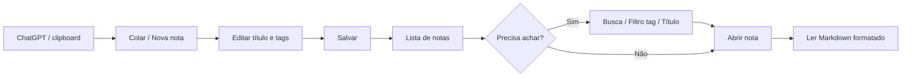

# Documentação de Requisitos — Notas v2

**Versão:** 1.0  
**Data:** 2026-05-20  
**Fontes:** `outputs/feature-suggester/*`, diretrizes do Product Owner template  
**Stakeholder:** Usuário único (desenvolvedor/proprietário do produto)

---

## 1. Visão do produto

### 1.1 Objetivo de negócio

Construir um sistema web pessoal para **guardar, organizar e visualizar notas** — em especial respostas copiadas do ChatGPT — com **intuitividade, eficiência e visual moderno**.

### 1.2 Proposta de valor (resumo)

> Arquivo rápido do que a IA ensinou: colar, taguear, ler em Markdown e encontrar de novo sem fricção.

### 1.3 Métricas de sucesso

| Métrica | Meta |
|---------|------|
| Tempo para criar nota a partir do ChatGPT | ≤ 15 segundos |
| Notas com pelo menos 1 tag | ≥ 80% |
| Tempo para localizar nota conhecida | ≤ 30 segundos |
| Percepção de UX | Intuitivo, bonito, profissional, moderno |
| Responsividade | Uso confortável em mobile, tablet e desktop |

---

## 2. Usuários e personas

### Persona principal: **Tiago — Arquivista de conhecimento IA**

| Atributo | Descrição |
|----------|-----------|
| **Perfil** | Desenvolvedor / knowledge worker, único usuário do sistema |
| **Comportamento** | Copia respostas longas do ChatGPT, categoriza por tema via tags, revisita para consulta técnica |
| **Motivação** | Não perder insights; ter biblioteca pessoal pesquisável e legível |
| **Frustrações** | Histórico do ChatGPT difícil de achar; formatação quebrada ao colar; apps genéricos pesados |
| **Expectativa técnica** | Web app rápido, sem configuração de vault; visual premium |

*Não há personas secundárias no escopo atual (sem multi-usuário, sem colaboração).*

---

## 3. Jornada do usuário

### Etapas detalhadas

| Etapa | Ação do usuário | Necessidade do sistema |
|-------|-----------------|------------------------|
| 1. Captura | Copia resposta do ChatGPT | Paste-to-note ou formulário rápido |
| 2. Organização | Atribui tags, ajusta título/data | CRUD tags, vínculo N:N nota–tag |
| 3. Descoberta | Busca por título, clica em tag | Filtros, ordenação, lista/cards |
| 4. Consumo | Lê nota longa com código | Markdown, syntax highlight, layout leitura |
| 5. Manutenção | Edita, exclui, fixa notas importantes | CRUD completo, pinned (fase 2) |

---

## 4. Requisitos funcionais

### 4.1 Módulo Notas (RF-N)

| ID | Requisito | Prioridade | Fase |
|----|-----------|------------|------|
| RF-N01 | Criar nota com título, conteúdo e data de publicação | Must | 0 |
| RF-N02 | Listar notas com preview (título, data, tags) | Must | 0 |
| RF-N03 | Editar nota existente | Must | 0 |
| RF-N04 | Excluir nota (com confirmação) | Must | 0 |
| RF-N05 | Visualizar nota em página dedicada com formatação rica | Must | 0 |
| RF-N06 | Filtrar listagem por título (busca textual) | Must | 0 |
| RF-N07 | Ordenar por data ou título | Should | 2 |
| RF-N08 | Colar conteúdo com detecção de título e data automática | Should | 1 |
| RF-N09 | Renderizar conteúdo como Markdown na visualização | Should | 1 |
| RF-N10 | Buscar texto dentro do corpo da nota | Should | 1 |
| RF-N11 | Fixar notas no topo da lista | Could | 2 |
| RF-N12 | Alternar vista cards / lista compacta | Could | 2 |
| RF-N13 | Filtrar por intervalo de datas de publicação | Could | 2 |

### 4.2 Módulo Tags (RF-T)

| ID | Requisito | Prioridade | Fase |
|----|-----------|------------|------|
| RF-T01 | Criar, editar e excluir tags | Must | 0 |
| RF-T02 | Associar uma ou mais tags a uma nota | Must | 0 |
| RF-T03 | Filtrar notas ao clicar em uma tag | Must | 0 |
| RF-T04 | Exibir cor por tag e quantidade de notas vinculadas | Should | 2 |
| RF-T05 | Listar tags mais usadas na sidebar | Could | 2 |

### 4.3 Módulo Interface e UX (RF-U)

| ID | Requisito | Prioridade | Fase |
|----|-----------|------------|------|
| RF-U01 | Layout responsivo (mobile, tablet, desktop) | Must | 0 |
| RF-U02 | Visual moderno, intuitivo e profissional (Chakra UI v3) | Must | 0 |
| RF-U03 | Tema claro e escuro com persistência de preferência | Should | 1 |
| RF-U04 | Syntax highlight e botão copiar em blocos de código | Should | 1 |
| RF-U05 | Atalhos de teclado para ações frequentes | Could | 2 |
| RF-U06 | Modo leitura focada (zen) na página de nota | Could | 3 |

### 4.4 Requisitos futuros (fora do MVP)

| ID | Requisito | Prioridade |
|----|-----------|------------|
| RF-F01 | Busca semântica por embeddings | Won't (agora) |
| RF-F02 | Extensão de navegador “Salvar no Notas” | Won't (agora) |
| RF-F03 | PWA + sincronização multi-dispositivo | Won't (agora) |
| RF-F04 | Integração API OpenAI in-app | Won't (agora) |

---

## 5. Requisitos não funcionais

### 5.1 Stack técnica (obrigatória)

| Camada | Tecnologia |
|--------|------------|
| Framework web | **Next.js** (React, App Router recomendado) |
| API / persistência | **API Routes** do Next.js + **Prisma ORM** |
| Banco de dados | **Neon** (PostgreSQL serverless) |
| UI | **Chakra UI v3** |
| Conteúdo | Markdown (armazenado como texto; render na UI) |

### 5.2 Performance

| ID | Requisito |
|----|-----------|
| RNF-P01 | Listagem inicial ≤ 2s com até 200 notas |
| RNF-P02 | Busca por título ≤ 500ms (client ou server) |
| RNF-P03 | Página de visualização renderiza Markdown ≤ 1s para notas até 50k caracteres |

### 5.3 Usabilidade e acessibilidade

| ID | Requisito |
|----|-----------|
| RNF-A01 | Contraste mínimo WCAG AA em tema claro e escuro |
| RNF-A02 | Navegação por teclado em formulários e listas |
| RNF-A03 | Touch targets ≥ 44px em mobile |
| RNF-A04 | Breakpoints: mobile (&lt;768px), tablet (768–1024px), desktop (&gt;1024px) |

### 5.4 Segurança e dados

| ID | Requisito |
|----|-----------|
| RNF-S01 | Variáveis de conexão Neon apenas em ambiente servidor (`.env`) |
| RNF-S02 | Validação de entrada nas API Routes (tamanho título/conteúdo, sanitização) |
| RNF-S03 | Uso pessoal — autenticação opcional no MVP (documentar se ausente) |

### 5.5 Manutenibilidade

| ID | Requisito |
|----|-----------|
| RNF-M01 | Schema Prisma versionado com migrations |
| RNF-M02 | Componentes UI reutilizáveis (Chakra + composição) |
| RNF-M03 | Separação clara: `app/` páginas, `components/`, `lib/prisma`, `app/api/` |

---

## 6. Modelo de dados (requisitos de domínio)

### Entidade: Note

| Campo | Tipo | Obrigatório | Regras |
|-------|------|-------------|--------|
| id | UUID / cuid | Sim | PK |
| title | string | Sim | 1–200 caracteres |
| content | text | Sim | Markdown plain text |
| publishedAt | datetime | Sim | Default: now na criação |
| pinned | boolean | Não | Default false (fase 2) |
| createdAt | datetime | Sim | Auto |
| updatedAt | datetime | Sim | Auto |

### Entidade: Tag

| Campo | Tipo | Obrigatório | Regras |
|-------|------|-------------|--------|
| id | UUID / cuid | Sim | PK |
| name | string | Sim | Único, 1–50 caracteres |
| color | string | Não | Hex ou token Chakra (fase 2) |
| createdAt | datetime | Sim | Auto |

### Relação: Note ↔ Tag

- **N:N** via tabela `NoteTag` ou implícita Prisma `tags Tag[]` em Note.

---

## 7. Restrições e premissas

### Restrições

- Orçamento e prazo não definidos — priorização por valor, não por data fixa.
- Equipe de desenvolvimento: efetivamente **1 pessoa**.
- Sem requisitos de colaboração, compartilhamento ou monetização.

### Premissas

- Conteúdo das notas é majoritariamente **Markdown** gerado por ChatGPT.
- Neon estará disponível e configurado antes do desenvolvimento do backend.
- Chakra UI v3 é a única biblioteca de componentes visuais no escopo.

### Dependências

| Dependência | Impacto |
|-------------|---------|
| Feature Suggester outputs | Backlog e prioridades |
| Conta Neon + connection string | Bloqueante para API/Prisma |
| Biblioteca Markdown (ex.: react-markdown) | Fase 1 visualização |

---

## 8. Fora de escopo (MVP + fases 1–2)

- Autenticação multi-usuário
- Colaboração em tempo real
- Comentários em notas
- Anexos / upload de arquivos
- Export/import em massa (fase posterior)
- App nativo iOS/Android
- Integração direta ChatGPT API

---

## 9. Rastreabilidade

| Documento | Relação |
|-----------|---------|
| `feature-suggestions.md` | Origem das features |
| `feature-roadmap.md` | Fases de entrega |
| `user-stories.md` | Decomposição em stories |
| `backlog.md` | Priorização executável |
| `acceptance-criteria.md` | Testabilidade |

---

## 10. Aprovação e próximos passos

| Papel | Ação |
|-------|------|
| Stakeholder (usuário) | Validar requisitos Must vs Should |
| Architect | Modelar schema Prisma, API Routes, estrutura Next |
| UX / UI Designer | Wireframes lista, detalhe, tags, responsivo |
| Frontend / Backend Dev | Implementar Sprint 0 conforme `backlog.md` |

---

*Documento gerado pelo agente Product Owner — Notas v2.*
