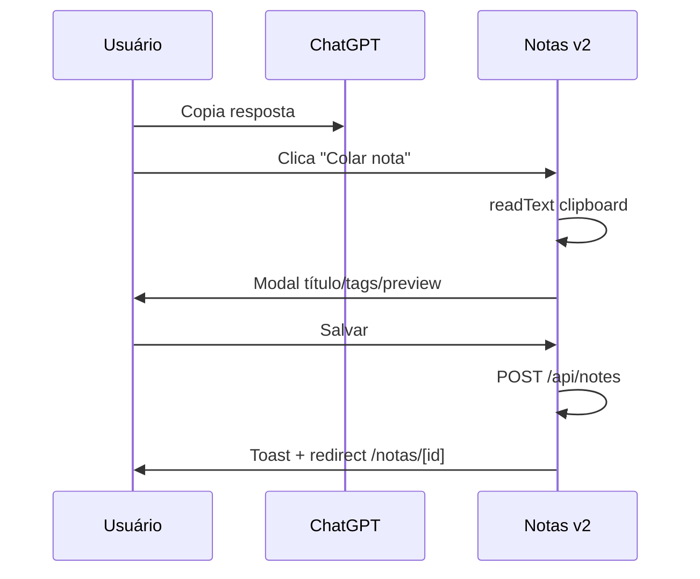
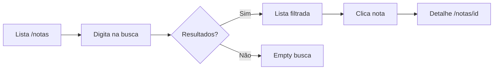
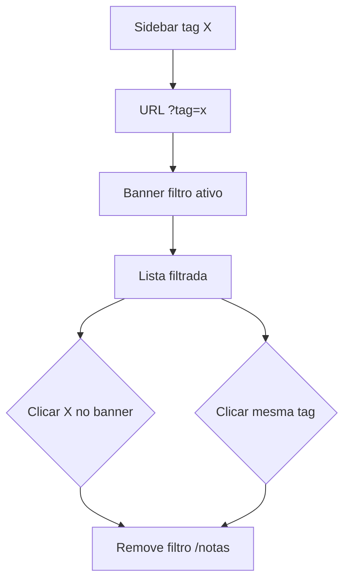
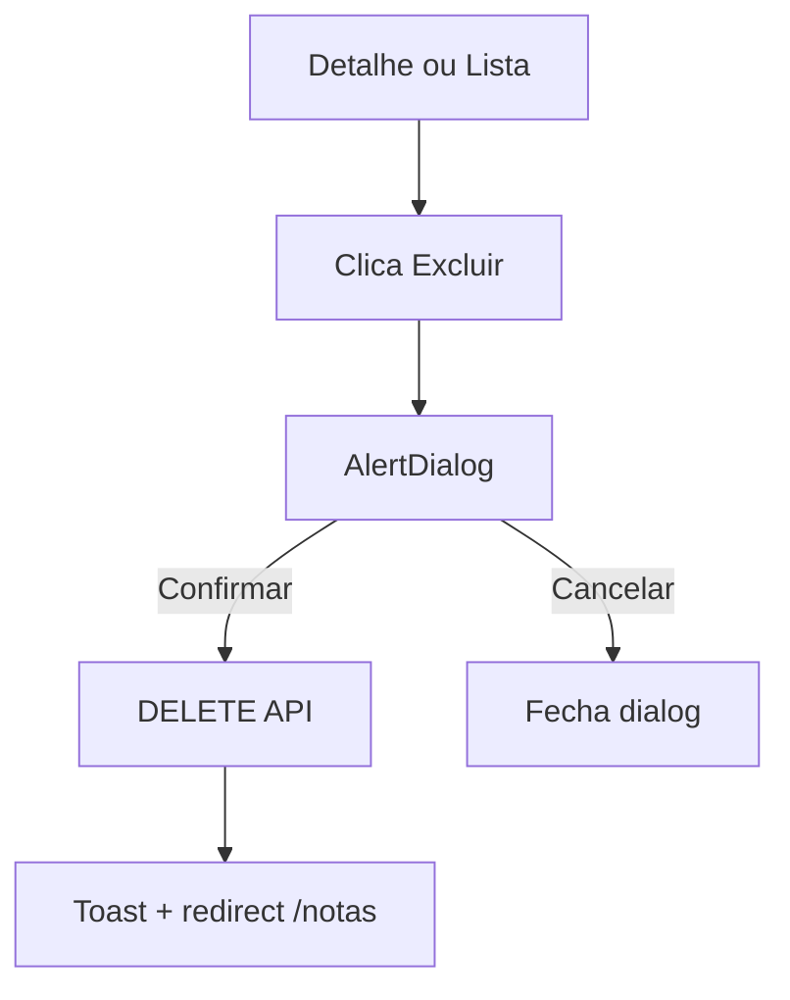

# Protótipos — Fluxos de Usuário

**Produto:** Notas v2  
**Base:** User stories US-001 a US-021

---

## Fluxo F1 — Arquivar resposta do ChatGPT (crítico)

**Objetivo:** Captura em ≤ 15 segundos (meta PO)

### F1a — Via Colar (Fase 1 — preferido)

| Passo | Ação | Sistema | Tela |
|-------|------|---------|------|
| 1 | Ctrl+C no ChatGPT | — | Externo |
| 2 | Abre `/notas` | Carrega lista | Lista |
| 3 | Clica **Colar nota** | Abre modal, parse título | Modal |
| 4 | Opcional: adiciona tags | — | Modal |
| 5 | Clica **Salvar** | POST, 201 | Detalhe |
| 6 | — | Toast "Nota salva" | Detalhe |

**Erros:** clipboard vazio → mensagem; API falha → toast + modal aberto.

### F1b — Via Nova nota (MVP Fase 0)

| Passo | Ação | Tela |
|-------|------|------|
| 1 | Clica **Nova nota** | Form |
| 2 | Cola no textarea conteúdo | Form |
| 3 | Preenche título, tags, data | Form |
| 4 | Salvar | Detalhe |

---

## Fluxo F2 — Encontrar nota por título

| Passo | Comportamento |
|-------|---------------|
| 1 | Debounce 300ms após digitar |
| 2 | Filtro client ou `GET /api/notes?q=` |
| 3 | Clique na row → navegação |
| 4 | Limpar busca restaura lista |

**Fase 1:** mesma busca inclui conteúdo; highlight opcional no preview.

---

## Fluxo F3 — Filtrar por tag

| Regra | Detalhe |
|-------|---------|
| Toggle | Segundo clique na mesma tag remove filtro |
| Combinar | Tag + busca título AND |
| Persistência | Query string permite bookmark |
| Chips na nota | Clique tag no detalhe → `/notas?tag=` |

---

## Fluxo F4 — Ler nota longa com código

| Passo | Ação | Feedback |
|-------|------|----------|
| 1 | Abre `/notas/[id]` | Skeleton → conteúdo MD |
| 2 | Scroll no artigo | — |
| 3 | Hover bloco código | Botão Copiar aparece |
| 4 | Clica Copiar | Toast "Copiado" |
| 5 | Clica link externo | Nova aba |

---

## Fluxo F5 — Editar nota

| Passo | Tela |
|-------|------|
| 1 | Detalhe → **Editar** | `/notas/[id]/editar` |
| 2 | Altera campos | Form |
| 3 | **Salvar** | PUT → redirect detalhe |
| 4 | Cancelar sem mudanças | Volta detalhe/lista |
| 5 | Cancelar com dirty | Dialog confirmação |

---

## Fluxo F6 — Excluir nota

---

## Fluxo F7 — Gerenciar tags

| Passo | Ação |
|-------|------|
| 1 | Sidebar → Gerenciar tags | `/tags` |
| 2 | Nova tag → modal → POST | Lista atualiza |
| 3 | Editar → modal → PUT | — |
| 4 | Excluir → dialog → DELETE | Notas desvinculadas |

---

## Fluxo F8 — Mobile consulta rápida

| Passo | Ação |
|-------|------|
| 1 | Abre app no celular | `/notas` |
| 2 | [☰] → seleciona tag | Drawer fecha, lista filtra |
| 3 | Tap na nota | Detalhe legível |
| 4 | Pinch/zoom não necessário | Texto já legível |

---

## Mapa fluxo × prioridade MVP

| Fluxo | MVP F0 | MVP+ F1 |
|-------|--------|---------|
| F1b Nova nota manual | ✅ | — |
| F1a Colar nota | — | ✅ |
| F2 Busca título | ✅ | Conteúdo |
| F3 Filtro tag | ✅ | — |
| F4 Leitura MD | básica | ✅ full MD |
| F5 Editar | ✅ | — |
| F6 Excluir | ✅ | — |
| F7 Tags CRUD | ✅ | — |
| F8 Mobile | ✅ | — |

---

## Cenários de teste vinculados

Ver `../usability-reports.md` tarefas T1–T6.
