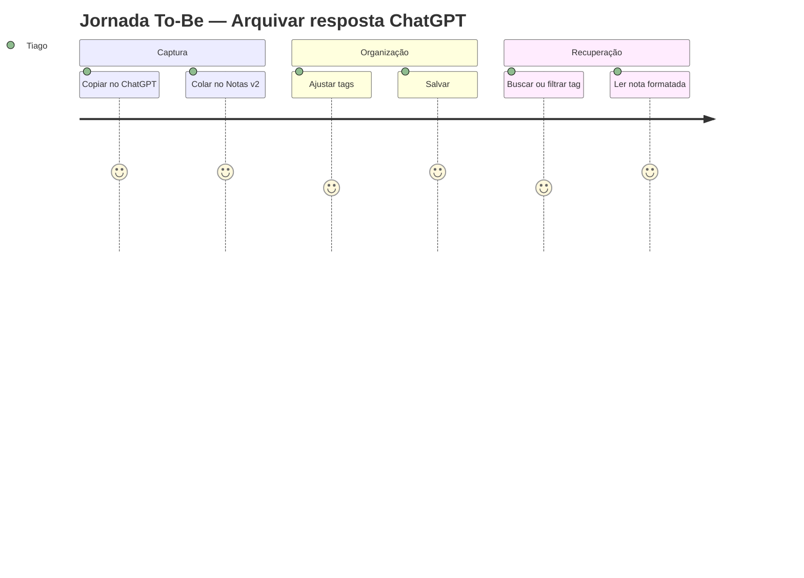

# Pesquisa de Usuário — Notas v2

**Data:** 2026-05-20  
**Método:** Síntese de diretrizes do stakeholder + análise de requisitos (Product Owner) + benchmarking de apps de notas  
**Participantes:** 1 stakeholder (usuário único e desenvolvedor do produto)  
**Referências:** `outputs/product-owner/requirements.md`, `user-stories.md`

---

## 1. Objetivo da pesquisa

Validar necessidades, dores e expectativas para desenhar uma experiência **intuitiva, eficiente e visualmente moderna** em um app web pessoal de notas — com foco no fluxo **ChatGPT → arquivar → organizar → reler**.

---

## 2. Contexto e hipóteses

### Hipóteses iniciais

| ID | Hipótese | Status |
|----|----------|--------|
| H1 | O fluxo mais frequente é colar texto do ChatGPT, não digitar do zero | **Confirmada** |
| H2 | Tags são o principal mecanismo de organização (não pastas) | **Confirmada** |
| H3 | Busca por título é insuficiente; conteúdo precisa ser pesquisável | **Confirmada** (Fase 1) |
| H4 | Visual “bonito e profissional” impacta adoção diária | **Confirmada** |
| H5 | Uso em mobile é secundário mas necessário para consulta | **Parcial** — consulta sim; captura principalmente desktop |

---

## 3. Persona

### Tiago — Arquivista de conhecimento IA

```
┌─────────────────────────────────────────────────────────┐
│  Tiago,  desenvolvedor / knowledge worker               │
│  ─────────────────────────────────────────────────────  │
│  "Quero um lugar só para o que o ChatGPT me explicou,    │
│   organizado e fácil de achar depois."                    │
├─────────────────────────────────────────────────────────┤
│  OBJETIVOS          │  FRUSTRAÇÕES                      │
│  • Arquivar rápido  │  • Histórico ChatGPT confuso      │
│  • Ler com conforto │  • Formatação perdida ao colar    │
│  • Achar por tema   │  • Notion/Obsidian pesados demais │
├─────────────────────────────────────────────────────────┤
│  COMPORTAMENTO      │  CONTEXTO DE USO                  │
│  • Copia/cola MD    │  • Desktop: captura + edição        │
│  • 2–5 tags/nota    │  • Mobile/tablet: leitura rápida  │
│  • Releitura esp.   │  • Sessões curtas (2–10 min)      │
└─────────────────────────────────────────────────────────┘
```

| Dimensão | Detalhe |
|----------|---------|
| **Tech literacy** | Alta — confortável com Markdown, atalhos, APIs |
| **Frequência esperada** | Diária ou várias vezes por semana |
| **Volume de notas** | Crescimento contínuo (dezenas → centenas) |
| **Critério de sucesso** | ≤ 15s para arquivar; ≤ 30s para encontrar |

*Não há personas secundárias no escopo MVP.*

---

## 4. Jornada do usuário (as-is vs to-be)

### 4.1 As-is (hoje, sem Notas v2)

| Etapa | Ação | Dor | Emoção |
|-------|------|-----|--------|
| 1 | Pergunta ao ChatGPT | — | Neutro |
| 2 | Copia resposta | — | Satisfeito |
| 3 | Cola em Keep/Notion/arquivo | Formatação quebra; sem tags consistentes | Frustrado |
| 4 | Tenta achar depois | Busca fraca; histórico ChatGPT | Ansioso |
| 5 | Desiste ou recria pergunta | Perda de tempo | Negativo |

### 4.2 To-be (com Notas v2)

| Etapa | Ação | Touchpoint | Oportunidade UX |
|-------|------|------------|-----------------|
| 1 | Copia do ChatGPT | Clipboard | — |
| 2 | Abre Notas v2 → **Colar nota** | Header CTA / atalho | Fluxo em 1 clique (Fase 1) |
| 3 | Ajusta título/tags | Form compacto | Tags sugeridas (futuro) |
| 4 | Salva | Toast sucesso | Feedback imediato |
| 5 | Lista / filtra por tag | Home + sidebar tags | Scan visual com cores |
| 6 | Abre e lê | Página leitura | Markdown + código copiável |
| 7 | Busca termo técnico | Busca global | Full-text (Fase 1) |



---

## 5. Mapa de dores e necessidades

| Dor | Impacto | Necessidade correspondente | Feature |
|-----|---------|---------------------------|---------|
| Colar é lento e manual | Alto | Captura em &lt; 15s | Paste-to-note, CTA visível |
| Markdown não renderiza | Alto | Leitura fiel | Página visualização MD |
| Não acho por palavra no corpo | Alto | Busca full-text | Campo busca expandido |
| Tags sem hierarquia visual | Médio | Scan rápido | Chips coloridos + sidebar |
| UI genérica/feia | Médio | Confiança e prazer de uso | Chakra, tema, tipografia leitura |
| Medo de perder dados | Médio | Controle | Confirmação exclusão; export futuro |
| Lista longa confusa | Médio | Orientação | Ordenação, pinned, filtros data |

---

## 6. Jobs to be Done (JTBD)

**Quando** termino uma conversa útil com o ChatGPT,  
**quero** guardar a resposta formatada e categorizada,  
**para** consultar depois sem repetir a pergunta.

**Quando** estou resolvendo um problema técnico,  
**quero** encontrar uma nota antiga por palavra-chave ou tag,  
**para** aplicar a solução que já obtive antes.

**Quando** abro o app no celular,  
**quero** ler uma nota com conforto,  
**para** relembrar o conteúdo sem zoom ou scroll horizontal.

---

## 7. Benchmark rápido (UX)

| App | O que funciona bem | O que evitar |
|-----|-------------------|--------------|
| **Notion** | Hierarquia, blocos ricos | Setup pesado, lentidão |
| **Bear** | Tipografia, tags `#` | Ecossistema fechado Apple |
| **Obsidian** | Markdown, links | Curva vault/plugins |
| **Keep** | Velocidade captura | Sem MD, leitura longa ruim |
| **Mem** | Auto-organização | Opaco, SaaS |

**Implicação para Notas v2:** Velocidade do Keep + leitura do Bear + Markdown do Obsidian, sem complexidade de configuração.

---

## 8. Cenários de uso prioritários

| # | Cenário | Frequência | Prioridade UX |
|---|---------|------------|---------------|
| C1 | Colar resposta ChatGPT e salvar com tags | Alta | P0 |
| C2 | Buscar nota por título | Alta | P0 |
| C3 | Filtrar listagem clicando em tag | Alta | P0 |
| C4 | Ler nota longa com código | Alta | P0 |
| C5 | Criar/editar nota manualmente | Média | P0 |
| C6 | Gerenciar tags (criar, renomear) | Média | P0 |
| C7 | Buscar palavra no conteúdo | Média | P1 |
| C8 | Consultar nota no mobile | Média | P0 |
| C9 | Ordenar e fixar notas | Baixa | P2 |

---

## 9. Requisitos de experiência (derivados)

| ID | Requisito UX | Rastreio PO |
|----|--------------|-------------|
| UX-01 | Máximo 2 cliques da home até nota salva (fluxo colar) | US-011 |
| UX-02 | Área de leitura max-width ~720px, line-height ≥ 1.6 | US-005, RNF-A01 |
| UX-03 | Busca sempre visível no header | US-006, US-013 |
| UX-04 | Tag ativa como filtro claramente indicada | US-009 |
| UX-05 | Empty states com CTA orientador | US-002 |
| UX-06 | Confirmação antes de excluir | US-004 |
| UX-07 | Skeleton loading, nunca tela branca | US-002 |
| UX-08 | Touch targets ≥ 44px em mobile | US-010, RNF-A03 |

---

## 10. Insights e recomendações

### Insights

1. **Captura é o momento crítico** — Se colar for difícil, o usuário volta ao ChatGPT/Keep.
2. **Leitura é o segundo momento crítico** — Notas longas exigem tipografia e MD; texto plano mata o valor.
3. **Tags substituem pastas** — Sidebar de tags + chips na lista é padrão mental esperado.
4. **Busca no header** — Padrão universal (Notion, Bear); não esconder em menu.
5. **Um usuário ≠ simplificar demais** — Ainda precisa polish profissional (não parecer “CRUD de tutorial”).

### Recomendações para design

| Prioridade | Recomendação |
|------------|--------------|
| P0 | CTA primário **“Colar nota”** no header (ao lado de Nova nota) |
| P0 | Layout 2 colunas desktop: sidebar tags + lista; drawer no mobile |
| P0 | Página de leitura com hierarquia clara: título → meta (data, tags) → corpo |
| P1 | Busca unificada (título + conteúdo) com debounce e resultados inline |
| P1 | Toggle tema no header, persistido |
| P2 | Vista cards para exploração; lista para busca rápida |

---

## 11. Validação pendente (pós-MVP)

| Método | Quando | Métrica |
|--------|--------|---------|
| Teste de usabilidade moderado (5 tarefas) | Após Sprint 3 | Taxa conclusão ≥ 90% |
| Métrica tempo C1 | Uso real 1 semana | ≤ 15s captura |
| Entrevista rápida stakeholder | Após Sprint 4 | SUS ≥ 80 opcional |

---

## 12. Rastreabilidade

| Output UX | Uso |
|-----------|-----|
| `wireframes/*` | Estrutura de telas |
| `prototypes/*` | Estados e fluxos |
| `design-system.md` | Tokens e componentes Chakra |
| `usability-reports.md` | Avaliação heurística pré-dev |

---

*Pesquisa de usuário — agente UX, Notas v2.*
